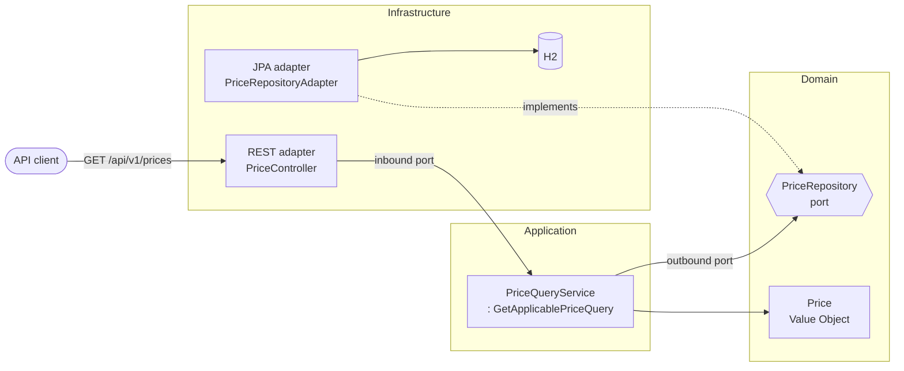

# Architecture

The Prices Service is a small read-side microservice that answers one question: **given a
product, a brand and an instant, which price applies?** Its design is driven by
**Domain-Driven Design (DDD)** realised through a **Hexagonal (Ports & Adapters)** structure.
This document explains the domain model first, then the structure, the quality attributes and
the decisions behind them.

> Every significant decision has an [Architecture Decision Record](docs/adr). They are
> referenced inline as `ADR-NNNN`.

## 1. Domain (DDD)

### Bounded context

A single bounded context — **Pricing**. It owns the rule that resolves the *applicable price*
of a product for a brand (sales chain) at a moment in time. There are no other contexts in this
exercise, so there is no context map; in the wider Inditex landscape this context would sit
behind a published REST contract consumed by order/logistics contexts.

### Ubiquitous language

| Term | Meaning in the model |
|------|----------------------|
| **Price** | A rate of a *brand* for a *product*, valid within a date range, with a final amount and currency. |
| **Brand** | A sales chain of the group (e.g. `1` = ZARA). |
| **Price list** (`priceList`) | Identifier of the applicable tariff. |
| **Priority** | Disambiguator: when ranges overlap, the **higher** priority wins. |
| **Applicable price** | The single price in force for a (product, brand, instant). |

The code speaks this language: `Price`, `priceList`, `priority`, `PriceRepository`,
`PriceNotFoundException`, `findApplicablePrice`.

### Tactical patterns applied

- **Value Object** — `Price` is immutable, has **no identity**, and validates its own
  invariants (mandatory fields; `endDate` not before `startDate`). The database surrogate key
  lives only in the JPA entity, never in the domain (ADR-0004).
- **Repository (as a port)** — `PriceRepository` is an interface **in the domain**; the JPA
  adapter implements it in infrastructure. This is simultaneously the DDD Repository pattern and
  the hexagonal outbound port.
- **Domain exception** — `PriceNotFoundException` models the "no applicable price" condition as
  a domain concept, decoupled from HTTP (the REST adapter maps it to 404).
- **Use case (inbound port)** — `GetApplicablePriceQuery` expresses the application's single
  capability; `PriceQueryService` implements it depending only on the domain.

### What we deliberately did *not* do

DDD is applied with judgement, not by rote. This context is a single read model, so there are
**no aggregates with behaviour, no domain events and no factories** — they would be ceremony
without value here. The one real tension — *where the "highest priority wins" rule lives* — is
resolved and documented in **ADR-0005**: the rule is realised as a read-optimised persistence
query (a CQRS-style projection) rather than an in-memory domain service that would be dead code.
If pricing became multi-factor, we would introduce an explicit `PriceSelectionPolicy` in the
domain and revisit that ADR.

## 2. Structure (Hexagonal / Ports & Adapters)

Dependencies point inwards only. The domain knows nothing about Spring, JPA or HTTP; the
boundary is **verified on every build** by ArchUnit (ADR-0010), not merely documented.

```
com.bcnc.prices
├── domain                      # Core — pure Java, zero framework imports
│   ├── model/Price             #   Value Object + invariants
│   ├── repository/PriceRepository   #   Outbound port
│   └── exception/PriceNotFoundException
├── application                 # Use cases — depends only on the domain
│   ├── port/in/GetApplicablePriceQuery   #   Inbound port
│   └── service/PriceQueryService
└── infrastructure              # Adapters & config — depends inwards only
    ├── adapter/in/rest         #   REST inbound adapter (Controller, advice, DTOs)
    ├── adapter/out/persistence #   JPA outbound adapter (Entity, Mapper, Repository)
    ├── config                  #   Spring wiring, security, OpenAPI
    └── security                #   JWT token service (dev-only — ADR-0008)
```



Wiring note: `PriceQueryService` is **not** a Spring component; it is instantiated as a
`@Bean` in `ApplicationConfig`, so the application layer stays framework-free. New use cases
follow the same pattern (define the port in `application`, wire the implementation in config).

### Request flow

`GET /api/v1/prices` → `PriceController` (validates input) → `GetApplicablePriceQuery` →
`PriceQueryService` → `PriceRepository` (port) → `PriceRepositoryAdapter` → Spring Data derived
query with DB-side `LIMIT 1` → `PriceMapper` → `Price` → `PriceResponse`. No match → domain
exception → RFC 7807 `404` (ADR-0007).

## 3. SOLID, concretely

- **SRP** — `PriceController` handles HTTP only; `PriceQueryService` orchestrates the use case;
  `PriceRepositoryAdapter` adapts persistence; `PriceMapper` translates entity↔domain.
- **OCP** — new delivery or storage mechanisms are new adapters against existing ports; the
  domain is untouched.
- **LSP** — any `PriceRepository` implementation (JPA adapter, a test double) is substitutable
  behind the port's contract.
- **ISP** — ports are minimal and intent-revealing: `PriceRepository` exposes a single method;
  `GetApplicablePriceQuery` exposes one use case.
- **DIP** — the domain defines the abstraction (`PriceRepository`); infrastructure depends on
  it. High-level policy does not depend on low-level detail. ArchUnit enforces this.

## 4. Quality attributes & trade-offs

- **Performance / scalability** — the winning row is selected in the database (`LIMIT 1`) over a
  composite index, so the application reads one row regardless of overlap (ADR-0002). For a
  read-heavy, mostly-static catalogue the next steps would be a read-through cache and/or read
  replicas.
- **Correctness / determinism** — the "single result" is deterministic via a total ordering
  (ADR-0003), covered by repository and integration tests.
- **Observability** — Spring Boot Actuator exposes health/info/metrics; the container health
  check uses `/actuator/health`.
- **Security** — a JWT resource server is included as a dev-only extra with stable keys
  (ADR-0008); it is out of the statement's scope and can be removed without touching the core.
- **Time zones** — `LocalDateTime` per the statement; a global deployment would standardise on
  UTC `Instant` (ADR-0006).

## 5. Testing strategy

- **Domain unit tests** (`PriceTest`) — invariants of the Value Object, no Spring.
- **Persistence slice** (`PriceRepositoryAdapterTest`, `@DataJpaTest`) — priority resolution and
  boundary dates against the seeded data.
- **End-to-end web tests** (`PriceControllerIntegrationTest`) — the five mandated scenarios as a
  parameterised test, the real JWT auth flow, validation and RFC 7807 error bodies; monetary
  values asserted as `BigDecimal`.
- **Smoke test** (`ApplicationSmokeTest`) — boots the app on a random port and exercises the real
  HTTP stack (actuator health + the protected endpoint with a real token).
- **Production-fidelity showcase** (`PostgresPriceRepositoryShowcaseTest`) — runs the query against
  a real PostgreSQL via Testcontainers; skipped where Docker is absent, so the H2 suite the
  statement requires is unaffected.
- **Architecture tests** (`HexagonalArchitectureTest`, ArchUnit) — the dependency rule.

CI (GitHub Actions) runs the full build/test on every push (Docker is available there, so the
Testcontainers showcase executes) and validates the Helm chart with `helm lint`/`template`.

## 6. Roadmap (what I would do next)

1. Externalise the catalogue to a real datastore; add caching/read replicas for scale.
2. Move time handling to UTC `Instant` with explicit zone conversion at the edges.
3. Replace the dev JWT mock with an external IdP; source keys from a secret manager.
4. Introduce a domain `PriceSelectionPolicy` if pricing becomes multi-factor (supersedes ADR-0005).
5. Contract tests (e.g. Spring Cloud Contract) for the consumers in the logistics landscape.
